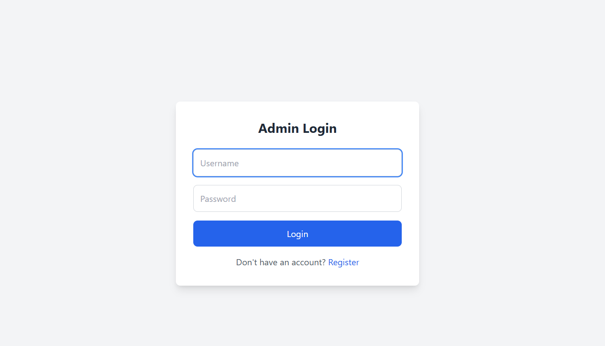
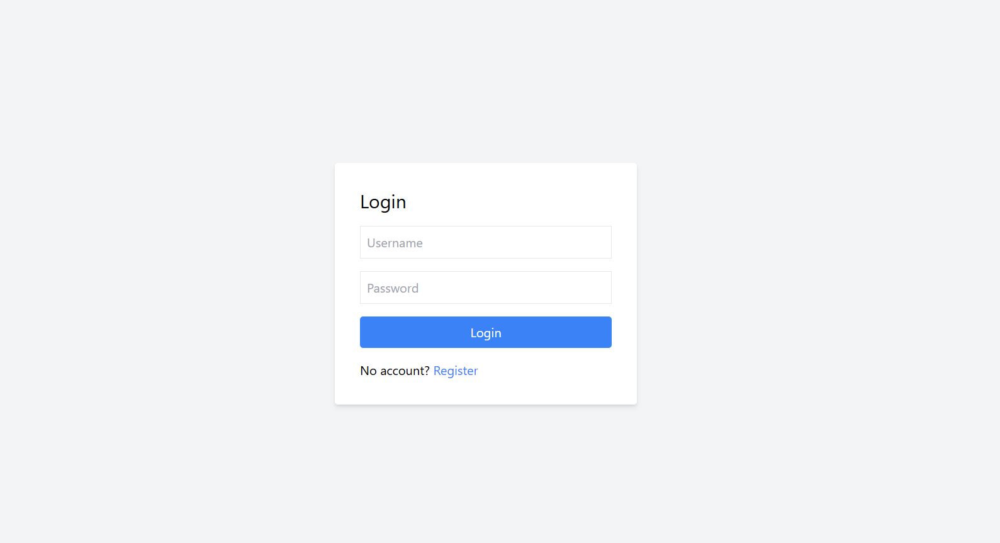
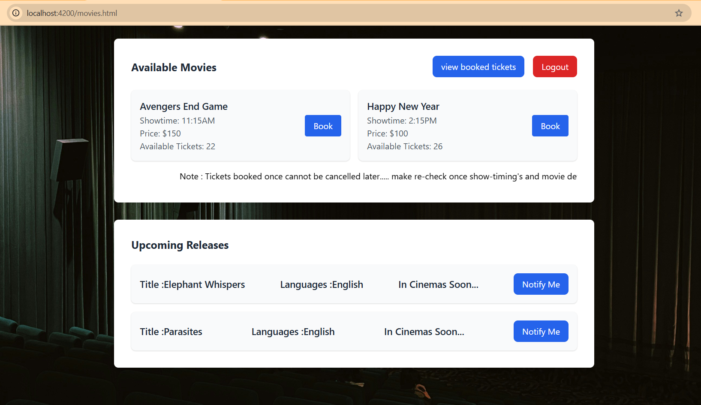
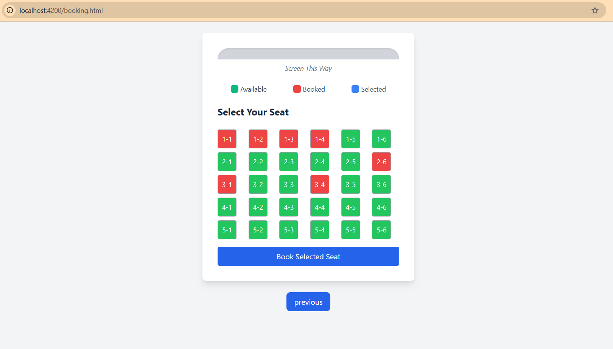
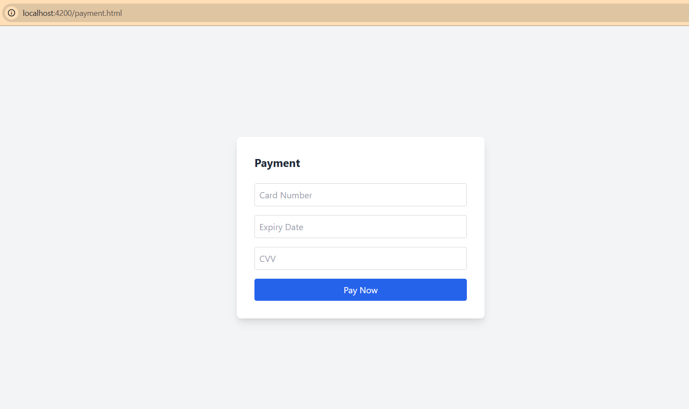
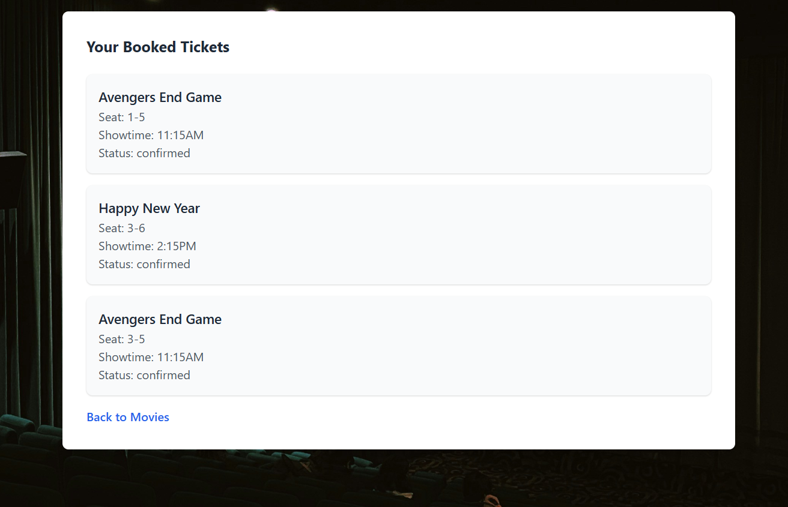
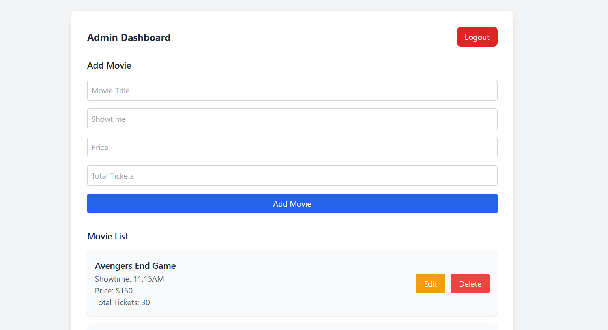

# Movie Ticket Booking System

A full-stack web application for booking movie tickets, built with Node.js, Express, and MongoDB, with a responsive Tailwind CSS frontend. Users can sign up, log in, browse movies, select seats, and book tickets, while admins manage movie listings. The system uses JWT for authentication and MongoDB atomic updates for concurrency.

## Features
- **User Authentication**: Secure signup/login with JWT and bcrypt password hashing.
- **Movie Management**: Admins can create, update, and delete movies via REST APIs.
- **Ticket Booking**: Users select seats and book tickets.
- **Responsive UI**: Tailwind CSS for a mobile-friendly interface with dynamic seat selection.
- **RBAC**: Role-based access control for user and admin roles.
- **Logout**: Clears JWT from localStorage for secure sessions.

## How it works

- **Sign Up/Login**: Register at /user-register.html or log in at /user-login.html.
- **Browse Movies**: View available movies at /movies.html.
- **Book Tickets**: Select seats at /booking.html and confirm bookings.
- **Admin Dashboard**: Admins manage movies at /admin-dashboard.html.
- **Logout**: Clear session at /logout.html.

## How Does it Look

 **index_page**
  .png)

 **login_page**
  

  

 **Movie Listing**
  

 **Seat Selection**
  

 **Payment**
   

 **Booked Tickets**
  

 **Admin Dashboard**
  
 

## Tech Stack
- **Backend**: Node.js, Express, MongoDB, Mongoose
- **Frontend**: HTML, Tailwind CSS, JavaScript
- **Security**: JWT (jsonwebtoken), bcryptjs
- **Others**: CORS, dotenv

## Installation
1. **Clone the Repository**:
   ```bash
   git clone https://github.com/Vinay-p668/TicketBooking.git
   cd movie-ticket-booking

2. **Install Dependencies**:
   ```bash
   npm install

3. **Set Up Environment Variables**:
   Create a .env file:env

   MONGO_URI=Atlas (or) localhost url
   JWT_SECRET=your_jwt_secret

4.**Start the Server**:
   ```bash
   npm start

5. **Access the App**:

   Open http://localhost:4200 in your browser


